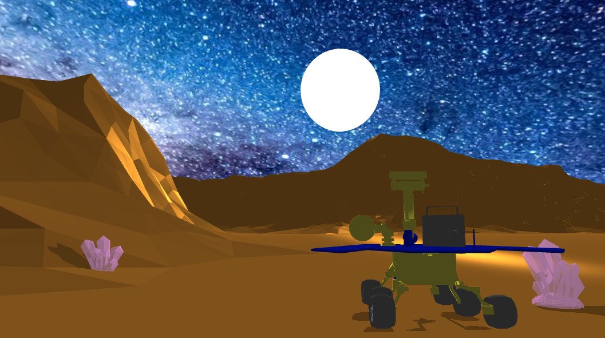
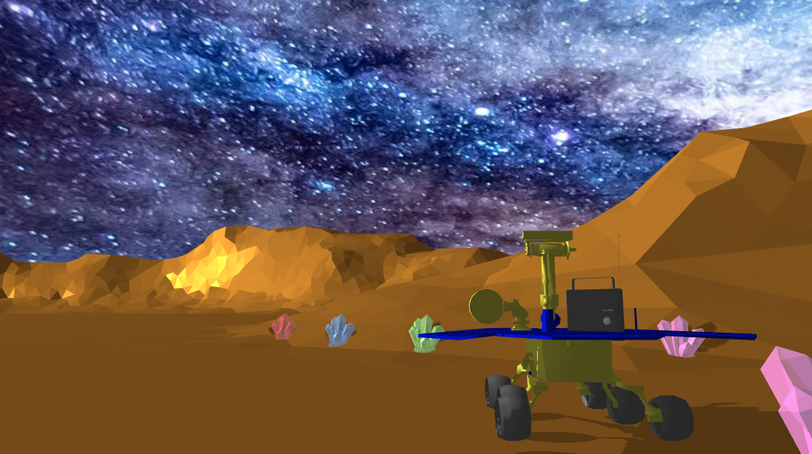

# Rover On Mars?

Group Project for Winter 2022 CS174A at UCLA

Ever wanted to explore Mars from the safety of your own home? How about helping to further our exploration of the cosmos by collecting Martian samples? “Rover on Mars?” is a 3rd-person Mars exploration rover simulator where you are tasked with the operation of a rover on a Martian-like landscape to explore and collect Martian samples for later analysis. The player will be able to control the rover using IJKL controls, and be able to collide with samples to collect them before a new sample becomes available in the play-area. Additionally, to enhance the player’s experience, several environmental factors can be controlled directly by the player, including the amount of dust cover, number of active samples, and time of Sol—the Martian-equivalent of an Earth day.

## Team Members:

- Harrison Cassar, harrison.cassar@gmail.com, harrisonCassar
- Grant Carroll, grantjcarroll@gmail.com , Grantcarroll
- Justin Nguyen, justinnguyen818@g.ucla.edu, jstnn818
- Alexander Chhor, chhor.alex@gmail.com, chhorizard

## Final Product:

## Details
Learn more about our project by referencing our [Final Proposal](RoverOnMars_FinalProjectProposal_CS174A.pdf).
